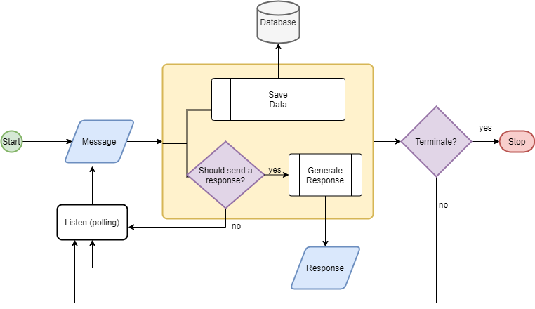

# Telegram Bot
[](https://colab.research.google.com/drive/1ggZkgzdYXiJ4uUY2dmib15Or4tvp9FvR?usp=sharing)

You will find it at https://t.me/messagecollector_bot


### Setting up the environment
Telegram bot is using these python dependencies
```python
import logging
import os
import telebot
from telegram import ParseMode
from telegram.ext import CallbackContext, Updater, CommandHandler, JobQueue, Dispatcher
import pymongo
import json
import pandas as pd
import jsonpickle
```
These environment variable are mandatory to run the bot. You can override them when you run the bot on Google Colab
or you can setup Heroku configs.
```python
BOT_TELEGRAM_API_TOKEN = ""
BOT_MONGODB_CONECTION_URL = ""
BOT_DATABASE_NAME = ""
```

#### Telegram
This is a Telegram Bot. It uses Telegram's HTTP API.
- Bot username on Telegram: ```@messagecollector_bot```

### Initializing the bot on Telegram
You can find the bot on Telegram. Initiate a chat or you can add the bot into your groups.
Then try these sample commands.
- /about - About this bot
- /help - Help topics

#### Registering the bot
BotFather is the parent of all Telegram Bots.This telegram bot is registered via BotFather. (```@messagecollector_bot```) and these parameters have been setup using the BotFather.
- Name of the bot
- Description of the bot
- Profile Picture of the bot
- Command list

#### Linking the bot with the code
Bot communicates with the backend python code using the bot-token. 
The bot-token is mandatory to run the bot.

#### Adding the bot into groups
Search ```@messagecollector_bot``` and add it into your group. Grant admin permission if you want to manage the group via the bot.

### Testing the Bot
To test the bot, use the .ipynb file on a Google Colab environment. Execute each step and run the bot.
At the end you can view collected data using python Pandas library.
Using python pandas library you can manipulate almost everything on your data.

#### Polling
To receive messages, the bot must do polling (continuous triggering the telegram API). 
```python
# start polling to continuously listen for messages
bot.polling()
# gracefully stop the bot after ctrl + c 
bot.stop_polling()
```
#### Sending messages into a specific Chat ID
Chat ID is same as the user ID if it's a private chat between the user and the bot. 
If the bot is inside a group, chat ID is different.
```python
bot.send_message(chat_id, txt)
#Ex: bot.send_message(-1001545752396, "Hi") -> 1664758714 is the chat ID (For private messages, group ID = Chat ID)
```
## Owner
This repository is owned by @astoneshi 

## License 
MIT, Not for Commercial purpose
